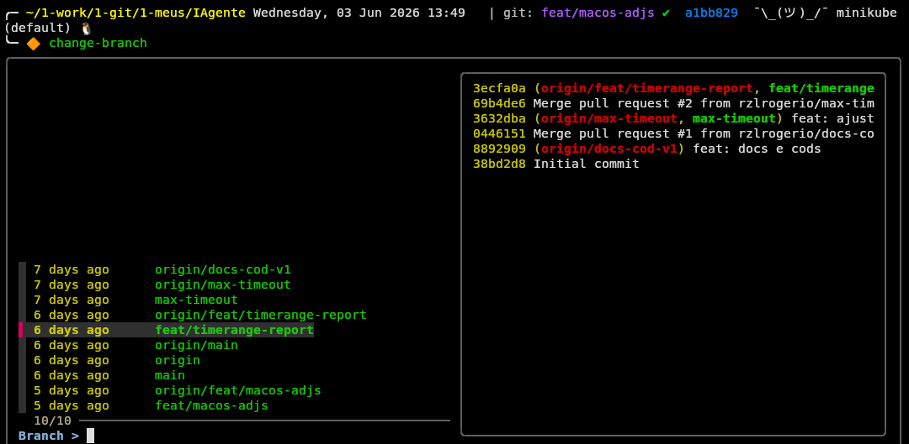
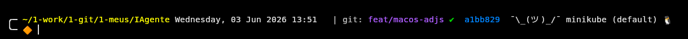

## Documentação rápida

- [Git tools](git/README.md)
- [Kubernetes tools](k8s/README.md)
- [Zsh tools](zsh/README.md)
- [PowerCLI tools](powercli/README.md)
- [Graph as Code tools](graph_as_a_code/README.md)
- [Cloud tools](cloud/README.md)
- [Monitoria e Observabilidade](monitoria_observabilidade/README.md)
- [Markdown tools](markdown/README.md)
- [WSL tools](wsl/README.md)
- [Configuração Zsh](zsh/rc/README.md)
- [get-restart](k8s/get-restart/README.md)
- [socorro](k8s/socorro/README.md)
- [PSP](psp/README.md)

## Uso

1. Navegue até o subdiretório desejado.
2. Abra o `README.md` correspondente.
3. Siga as instruções específicas para cada script ou configuração.

# Ferramentas

Este repositório contém utilitários e configurações úteis para Git, Kubernetes, PowerCLI e Zsh.

## Estrutura principal

- [`git/`](git/README.md)
  - [`change-branch`](git/change-branch) — script para selecionar e trocar de branch usando `git` + `fzf`
  - [`change-branch.png`](git/change-branch.png) — imagem ilustrativa do script
  - [`README.md`](git/README.md) — descrição do script e instruções básicas

- [`k8s/`](k8s/README.md)
  - [`get-restart/`](k8s/get-restart/README.md)
    - [`get-restart.sh`](k8s/get-restart/get-restart.sh) — busca pods que reiniciaram recentemente em um cluster Kubernetes
    - [`README.md`](k8s/get-restart/README.md) — documentação do script
  - [`socorro/`](k8s/socorro/README.md)
    - [`README.md`](k8s/socorro/README.md) — instruções e exemplos de uso do helper de comandos `kubectl`

- [`zsh/`](zsh/README.md)
  - [`README.md`](zsh/README.md) — documentação de configuração e ferramentas Zsh
  - [`bin/get-context.sh`](zsh/bin/get-context.sh) — script para exibir contexto Kubernetes no prompt
  - [`rc/install.sh`](zsh/rc/install.sh) — instalador da configuração Zsh
  - [`rc/README.md`](zsh/rc/README.md) — documentação do instalador e da configuração Zsh
  - [`theme/rogerio.png`](zsh/theme/rogerio.png) — screenshot do tema Zsh
  - [`theme/rogerio.zsh-theme`](zsh/theme/rogerio.zsh-theme) — tema personalizado para Oh My Zsh

- [`powercli/`](powercli/README.md)
  - [`README.md`](powercli/README.md) — documentação de scripts PowerCLI para vSphere/ESXi
  - Scripts PowerShell para automação de infraestrutura VMware

- [`graph_as_a_code/`](graph_as_a_code/README.md)
  - [`README.md`](graph_as_a_code/README.md) — documentação de scripts e configurações Graph as Code

- [`monitoria_observabilidade/`](monitoria_observabilidade/README.md)
  - [`README.md`](monitoria_observabilidade/README.md) — documentação de scripts e configurações de monitoria e observabilidade

- [`cloud/`](cloud/README.md)
  - [`README.md`](cloud/README.md) — documentação de ferramentas de AWS e Azure
  - [`aws/`](cloud/aws/README.md) — scripts e utilitários AWS SSO, EKS e inventário
    - [`inventario/`](cloud/aws/inventario/README.md) — utilitários de inventário AWS, contas e prompt
  - [`azure/`](cloud/azure/README.md) — scripts e utilitários Azure AKS

- [`markdown/`](markdown/README.md)
  - [`README.md`](markdown/README.md) — documentação dos utilitários de Markdown (leitor de terminal e conversor de PDF) e seus requisitos
  - [`md-2-pdf.sh`](markdown/md-2-pdf.sh) — script para converter arquivos Markdown (`.md`) para PDF usando Pandoc e XeLaTeX
  - [`readmd`](markdown/readmd) — script para ler arquivos Markdown (`.md`) formatados diretamente no terminal usando Pandoc e Lynx

- [`wsl/`](wsl/README.md)
  - [`README.md`](wsl/README.md) — documentação geral dos utilitários e otimizações para WSL
  - [`backup/`](wsl/backup/README.md) — solução de backup periódico do WSL para o OneDrive via `rsync` e `cron`
  - [`browser/`](wsl/browser/README.md) — integração de navegadores do Windows com o WSL
  - [`dns/`](wsl/dns/README.md) — script `fix-dns.sh` para corrigir problemas de DNS e VPN no WSL
  - [`ssh/`](wsl/ssh/README.md) — script `sync-ssh.sh` para importar e configurar chaves SSH do Windows de forma segura
  - [`wslconf-optimized/`](wsl/wslconf-optimized/README.md) — arquivo `wslconfig` com otimizações de performance, memória e recursos experimentais

- [`PSP/`](psp/README.md)
  - [`README.md`](psp/README.md) — documentação dos utilitários para sistemas de pagamentos (validador de dias de pagamento e feriados) e seus requisitos
  - [`validador_data.py`](psp/validador_dias_pgto/validador_data.py) — Validador de dias de pagamento com feriados em Python 
  - [`get_4o_5o_day.sh`](psp/validador_dias_pgto/get_4o_5o_day.sh) — Validador de dias de pagamento com feriados em Bash Shell Script

## Resultados

## Observações

- A imagem `git/change-branch.png` está incluída para exibição no modo web do GitHub.
- Os arquivos de documentação estão organizados por diretório para facilitar a leitura.

- **Recomendação:** use `kubectx` para alternar rapidamente entre contexts/namespaces do Kubernetes.

- **Links úteis:**
  - [Oh My Zsh](https://ohmyz.sh/) — gerenciador de temas e plugins para Zsh
  - [kubectl](https://kubernetes.io/docs/reference/kubectl/) — documentação oficial do cliente Kubernetes
  - [fzf](https://github.com/junegunn/fzf) — fuzzy finder usado por scripts interativos
